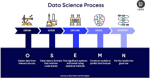

# Module 2 Final Project

## Introduction

Using housing data, I will try to predict housing prices using a regression model. There are many potential use cases for forecasting housing prices. A real-estate professional may be interested in forecasting revenue. A homeowner may be interested in identifying important features that affect sales price so that they can make appropriate renovation decisions before selling. In any case, my hypothesis is that the specific housing features I collect, such as square footage, bedrooms, etc, are predictive of future housing prices.

## Obtain Data
The data for this project comes from Kaggle’s House Prices Dataset. The dataset consists of 21597 houses and 21 columns. Each column contains feature, both qualitative and quantitative, that characterize a housing property. The price column is the target variable.

