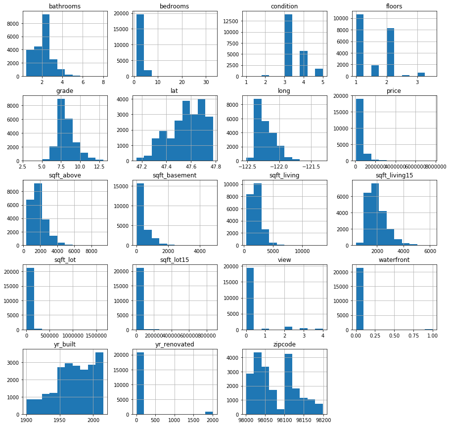

# Module 2 Final Project

## Introduction

Using housing data, I will try to predict housing prices using a regression model. There are many potential use cases for forecasting housing prices. A real-estate professional may be interested in forecasting revenue. A homeowner may be interested in identifying important features that affect sales price so that they can make appropriate renovation decisions before selling. In any case, my hypothesis is that the specific housing features I collect, such as square footage, bedrooms, etc, are predictive of future housing prices.

## Obtain Data
The data for this project comes from Kaggle’s House Prices Dataset. The dataset consists of 21597 houses and 21 columns. Each column contains feature, both qualitative and quantitative, that characterize a housing property. The price column is the target variable.

## Scrub Data
waterfront, view, and yr_renovated have missing values. Also, date and sqft_basement are string objects. Checking the percentage of null values in each of the 3 columns is good way to decide how to deal with null values. If the percentage is high, dropping the column will be a good approach. If the percentage is low , either dropping the rows, binning the columns or replacing the null values with each columns median, mean or mode.

## Explore Data

To get rid of outliers, I looked at it through plots and quantile, and I  defined a function using scipy library which considers the z-value(number of sigma) = 3 as threshold and returns True if z>3, which means these values are outliers, and return False if z<3, which means these values are not outliers. I used the function to confirm the outlier removal.

## Bathroom Outlier Removal
Looking at bathroom plot and using my scipy function of outlier removal, bathroom<=4, was the best choice.

Area of the interior living space which is' sqft_living' is linearly correlated with the sale price. Prices rise as sqft of living space increase.

.png)

## Longitude/Latitude

